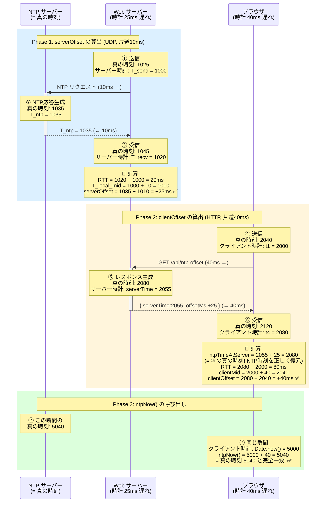
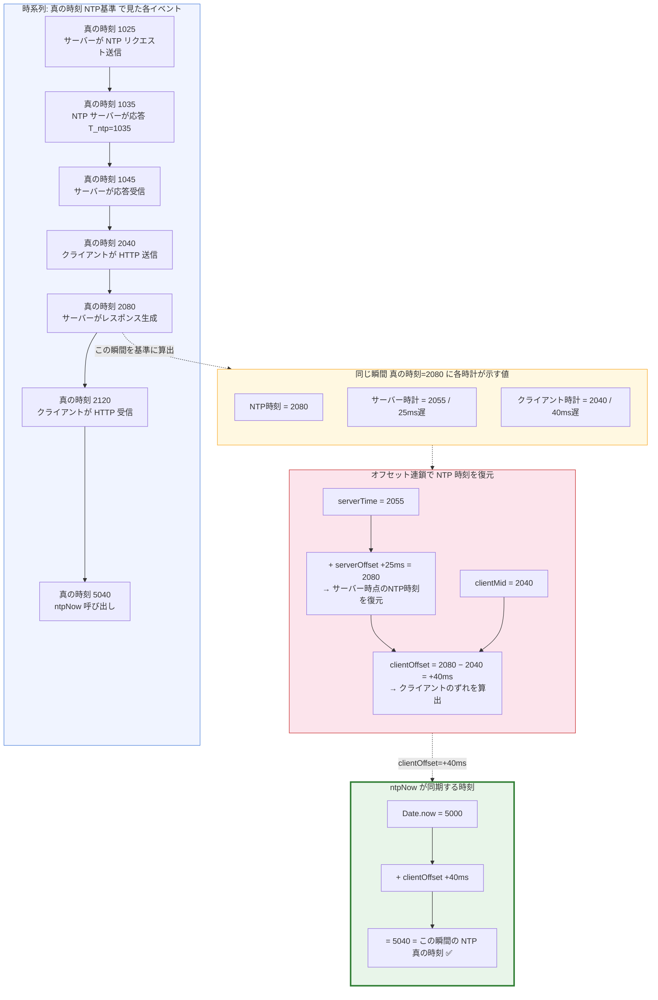

# NTP時刻をネットワーク上の遅延を考慮したうえでクライアントで推定するアルゴリズム

## 概要

ブラウザの `Date.now()` は OS の時計に依存しており、数百ミリ秒〜数秒のずれが生じ得る。本アルゴリズムでは、サーバーが NTP サーバーから取得した正確な時刻情報を HTTP 経由で中継し、クライアントが **RTT（往復遅延時間）の中間点推定** を用いて自身の時計の NTP に対するオフセットを算出する。

核心は **「2段階のオフセット連鎖」** と **「RTT の半分で中間点を推定する」** テクニックである。

## 全体アーキテクチャ

```
┌──────────┐     UDP/123      ┌──────────────┐     HTTP      ┌──────────────┐
│ NTP サーバー │ ◄──────────► │  Web サーバー   │ ◄──────────► │  ブラウザ      │
│ ntp.nict.jp│               │  (Node.js)    │              │ (クライアント) │
└──────────┘               └──────────────┘              └──────────────┘
     ▲                          ▲                            ▲
     │                          │                            │
  正確な時刻源           Phase 1 で offset 取得      Phase 2 で offset 算出
                                                     Phase 3 で補正済み時刻を利用
```

## メッセージフロー全体図



## Phase 1: サーバー ↔ NTP サーバー（serverOffset の算出）

### 処理フロー

サーバーは起動時および **60秒間隔** で NTP サーバー (`ntp.nict.jp`, ポート123) に UDP で問い合わせを行う。

### 記録するタイムスタンプ

```
T_send  = サーバーが NTP リクエストを送信した時刻 (Date.now())
T_recv  = サーバーが NTP レスポンスを受信した時刻 (Date.now())
T_ntp   = NTP サーバーから返却された時刻 (ms)
```

### 計算式

```
RTT_server  = T_recv − T_send
T_local_mid = T_send + RTT_server / 2
serverOffset = T_ntp − T_local_mid
```

| 計算                                    | 操作   | 目的                                                                 |
| --------------------------------------- | ------ | -------------------------------------------------------------------- |
| `RTT_server = T_recv − T_send`          | 引き算 | UDP 往復にかかった時間を測定                                         |
| `T_local_mid = T_send + RTT_server / 2` | 足し算 | NTP 応答が生成された瞬間のサーバーローカル時刻を推定（往復の中間点） |
| `serverOffset = T_ntp − T_local_mid`    | 引き算 | サーバー時計が NTP に対してどれだけずれているかを算出                |

### 中間点推定の原理

NTP レスポンスは通信経路の途中で生成される。往復の「行き」と「帰り」が対称（同じ遅延）であると仮定すると、NTP が応答を返した瞬間はリクエスト送信〜レスポンス受信の **ちょうど中間** にあたる。

```
   T_send                T_local_mid              T_recv
     │─── 行き (RTT/2) ───│─── 帰り (RTT/2) ───│
                           ▲
                    NTPが応答を返した瞬間
                    (この時点のサーバー時計を推定)
```

### 数値例

前提: サーバーの時計は NTP に対して **25ms 遅れ**、UDP 片道 10ms

| イベント         | 真の時刻 (NTP基準) | サーバー時計      |
| ---------------- | ------------------ | ----------------- |
| ① リクエスト送信 | 1025               | T_send = **1000** |
| ② NTP 応答生成   | 1035               | —                 |
| ③ レスポンス受信 | 1045               | T_recv = **1020** |

```
RTT_server  = 1020 − 1000 = 20ms
T_local_mid = 1000 + 10   = 1010
serverOffset = 1035 − 1010 = +25ms  (サーバー時計は25ms遅れ)
```

## Phase 2: クライアント ↔ サーバー（clientOffset の算出）

### 処理フロー

クライアントは初回ロード時および **30秒間隔** で `GET /api/ntp-offset` を呼び出す。

### 記録するタイムスタンプ

```
t1 = クライアントが HTTP リクエストを送信した時刻 (Date.now())
t4 = クライアントが HTTP レスポンスを受信した時刻 (Date.now())
```

サーバーからのレスポンスに含まれる値:

```json
{
  "serverTime": 2055,
  "offsetMs": 25
}
```

### 計算式

```
ntpTimeAtServer = serverTime + offsetMs     … サーバー時点のNTP正確時刻を復元
RTT_client      = t4 − t1                   … HTTP往復時間
clientMid       = t1 + RTT_client / 2       … サーバー応答瞬間のクライアント時刻を推定
clientOffset    = ntpTimeAtServer − clientMid  … クライアント時計のNTPに対するずれ
```

| 計算                                          | 操作   | 目的                                                                                     |
| --------------------------------------------- | ------ | ---------------------------------------------------------------------------------------- |
| `ntpTimeAtServer = serverTime + serverOffset` | 足し算 | サーバーのローカル時刻に Phase 1 の offset を加え、**サーバー時点の NTP 正確時刻を復元** |
| `RTT_client = t4 − t1`                        | 引き算 | HTTP 往復にかかった時間を測定                                                            |
| `clientMid = t1 + RTT_client / 2`             | 足し算 | サーバーがレスポンスを返した瞬間のクライアントローカル時刻を推定                         |
| `clientOffset = ntpTimeAtServer − clientMid`  | 引き算 | クライアント時計が NTP に対してどれだけずれているかを算出                                |

### 数値例

前提: サーバーの時計は 25ms 遅れ、クライアントの時計は 40ms 遅れ、HTTP 片道 40ms

| イベント         | 真の時刻 (NTP基準) | サーバー時計          | クライアント時計 |
| ---------------- | ------------------ | --------------------- | ---------------- |
| ④ HTTP 送信      | 2040               | —                     | t1 = **2000**    |
| ⑤ レスポンス生成 | 2080               | serverTime = **2055** | —                |
| ⑥ HTTP 受信      | 2120               | —                     | t4 = **2080**    |

```
ntpTimeAtServer = 2055 + 25 = 2080  (= ⑤の真の時刻。NTP時刻を正しく復元!)
RTT_client      = 2080 − 2000 = 80ms
clientMid       = 2000 + 40 = 2040
clientOffset    = 2080 − 2040 = +40ms  (クライアント時計は40ms遅れ)
```

## Phase 3: 補正済み時刻の利用（ntpNow()）

### 計算式

```javascript
function ntpNow() {
  return Date.now() + clientOffset;
}
```

| 計算                                   | 操作   | 目的                                                            |
| -------------------------------------- | ------ | --------------------------------------------------------------- |
| `ntpNow() = Date.now() + clientOffset` | 足し算 | クライアントのローカル時刻に offset を加えて NTP 正確時刻を再現 |

### ntpNow() はどの時点の NTP 時刻と同期するか

**`ntpNow()` を呼び出した「その瞬間」の NTP 真の時刻と同期する。**

`clientOffset` は「クライアント時計と NTP 時刻の定数的なずれ」であるため、以後いつ `Date.now()` を読んでも `+ clientOffset` するだけで、**その瞬間の NTP 真の時刻**が得られる。

### 数値例

| 真の時刻 (NTP基準) | クライアント時計     | ntpNow()                   | 一致?       |
| ------------------ | -------------------- | -------------------------- | ----------- |
| 5040               | Date.now() = 5000    | 5000 + 40 = **5040**       | ✅ 完全一致 |
| 9999040            | Date.now() = 9999000 | 9999000 + 40 = **9999040** | ✅ 完全一致 |

## オフセット連鎖による NTP 時刻復元の全体像



## なぜこのアルゴリズムで正確な時刻が得られるのか

### 数学的な証明

各時計のずれを以下のように定義する:

- $\delta_S$ : サーバー時計のずれ（サーバー時計 = 真の時刻 − $\delta_S$）
- $\delta_C$ : クライアント時計のずれ（クライアント時計 = 真の時刻 − $\delta_C$）

**Phase 1** で求まる serverOffset:

$$
\text{serverOffset} = T_{\rm ntp} - T_{\rm localMid} = \delta_S
$$

RTT が対称であれば、$T_{\rm localMid}$ は NTP 応答瞬間のサーバー時計の読みと一致するため、差分はそのままサーバーのずれ $\delta_S$ になる。

**Phase 2** で求まる clientOffset:

$$
{\rm ntpTimeAtServer} = {\rm serverTime} + \delta_S = ({\rm 真の時刻} - \delta_S) + \delta_S = {\rm 真の時刻}
$$

$$
{\rm clientMid} = {\rm 真の時刻} - \delta_C \quad ({\rm RTT対称の場合})
$$

$$
{\rm clientOffset} = {\rm 真の時刻} - ({\rm 真の時刻} - \delta_C) = \delta_C
$$

**Phase 3** で得られる ntpNow():

$$
{\rm ntpNow}() = {\rm Date.now}() + \delta_C = ({\rm 真の時刻} - \delta_C) + \delta_C = {\rm 真の時刻}
$$

RTT が対称であれば、サーバーのずれ $\delta_S$ は途中で打ち消され、最終的にクライアント時計のずれ $\delta_C$ だけが `clientOffset` として残る。これを `Date.now()` に加算することで NTP 真の時刻が復元される。

## 精度に影響する要素

| 要素                    | 影響                                             | 対策                                    |
| ----------------------- | ------------------------------------------------ | --------------------------------------- |
| NTP UDP RTT の非対称性  | 行きと帰りの遅延が異なると `serverOffset` に誤差 | 60秒ごとに再同期                        |
| HTTP RTT の非対称性     | 行きと帰りの遅延が異なると `clientOffset` に誤差 | 30秒ごとに再同期                        |
| サーバー処理時間        | `serverTime` 算出後のレスポンス送信遅延          | `serverTime` はレスポンス生成直前に取得 |
| JavaScript タイマー精度 | `Date.now()` の分解能 (通常 1ms)                 | ±1ms の誤差は許容範囲                   |
| ネットワーク不安定      | RTT が大きいとき中間点の仮定が不正確になる       | UI に RTT を表示し品質を可視化          |

### 誤差の上限

RTT が完全に対称（行き = 帰り）であれば誤差はゼロ。非対称な場合、誤差は各通信経路の **行きと帰りの差の半分** に収まる。

$$
\text{誤差} \leq \frac{|d_{\rm 行き} - d_{\rm 帰り}|_{\rm UDP}}{2} + \frac{|d_{\rm 行き} - d_{\rm 帰り}|_{\rm HTTP}}{2}
$$

実用上、LAN 環境では数ミリ秒以内、インターネット経由でも数十ミリ秒程度の精度が期待できる。
